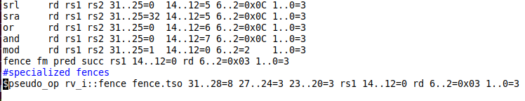
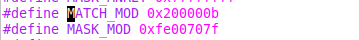
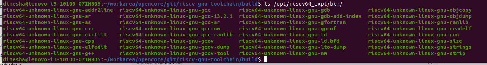

<p>This file Documents the sequence step to add custom instruction into the riscv toolchain</p>.
<p>File contributor: Mukund Vijayvergiya<mukundv.cs22@rvce.edu.in>/S SAHANA <ssahana.cs22@rvce.edu.in></p>

Instruction to be added:

```
mod r1, r2, r3
R[r1] = R[r2] % R[r3]
```

#1.  Clone the RISC-V opcodes repository: 
```
   git clone --depth 1 https://github.com/riscduino/riscv-opcodes.git
```
<table> <tr> <td  align="center"></td> </tr> </table>

#2. Adding the instruction to the RISC-V opcodes repository:
Since mod  operation is an integer related function it should be added to rv_i  file in the opcode repository.   
```
gvim rv_i and append text “mod  rd rs1 rs2 31..25=1  14..12=0 6..2=2    1..0=3”
```
<table> <tr> <td  align="center"></td> </tr> </table>

#3. Run make command to obtain MATCH and MASK  values. These values are present in the encoding.out.h file generated by parse.py.

```
make
gvim encoding.out.h and check “MATCH_MOD” and “MASK_MOD” text
```
<table> <tr> <td  align="center"></td> </tr> </table>


#4. Modifying riscv-opc.h file in :
Clone the riscv gnu tool chain
```
git clone --depth 1 https://github.com/riscv-collab/riscv-gnu-toolchain
```
modify the file: <riscv-gnu-toolchain>/binutils/include/opcode/riscv-opc.h
Additions to be done:
```
+ #define MATCH_MOD 0x200000b
+ #define MASK_MOD 0xfe00707f

+ DECLARE_INSN(mod, MATCH_MOD, MASK_MOD)
```

#5.Append below text in :<riscv-gnu-toolchain>/binutils/opcodes/riscv-opc.c

```
	 --name, xlen, isa, operands, match, mask, match_func, pinfo. 
	+ {"mod",         0, INSN_CLASS_I, "d,s,t",     MATCH_MOD, MASK_MOD,match_opcode,0},
```

#6.Building the new compiler inside the <riscv-gnu-toochain> folder
```
mkdir build
cd build
../configure  --prefix=/opt/riscv64_expt
sudo make linux
```

The result will be a 64-bit gnu compiler built at /opt/ricv64_expt. This compile will support the custom mod instruction.
```
ls /opt/riscv64_expt/bin/
riscv64-unknown-linux-gnu-addr2line  riscv64-unknown-linux-gnu-gcc         riscv64-unknown-linux-gnu-gdb            riscv64-unknown-linux-gnu-objcopy
riscv64-unknown-linux-gnu-ar         riscv64-unknown-linux-gnu-gcc-13.2.1  riscv64-unknown-linux-gnu-gdb-add-index  riscv64-unknown-linux-gnu-objdump
riscv64-unknown-linux-gnu-as         riscv64-unknown-linux-gnu-gcc-ar      riscv64-unknown-linux-gnu-gfortran       riscv64-unknown-linux-gnu-ranlib
riscv64-unknown-linux-gnu-c++        riscv64-unknown-linux-gnu-gcc-nm      riscv64-unknown-linux-gnu-gprof          riscv64-unknown-linux-gnu-readelf
riscv64-unknown-linux-gnu-c++filt    riscv64-unknown-linux-gnu-gcc-ranlib  riscv64-unknown-linux-gnu-ld             riscv64-unknown-linux-gnu-run
riscv64-unknown-linux-gnu-cpp        riscv64-unknown-linux-gnu-gcov        riscv64-unknown-linux-gnu-ld.bfd         riscv64-unknown-linux-gnu-size
riscv64-unknown-linux-gnu-elfedit    riscv64-unknown-linux-gnu-gcov-dump   riscv64-unknown-linux-gnu-lto-dump       riscv64-unknown-linux-gnu-strings
riscv64-unknown-linux-gnu-g++        riscv64-unknown-linux-gnu-gcov-tool   riscv64-unknown-linux-gnu-nm             riscv64-unknown-linux-gnu-strip
```

#7. Create following mod example at File: <riscv-gnu-toolchain>/test/mod/mod_test.c

```
#include <stdio.h>
int main() {
   int a,b,c;
   a = 5;
   b = 2;
   asm volatile (
     "mod %[z], %[x], %[y]\n\t"
      :[z] "=r" (c)
      :[x] "r" (a),[y] "r" (b)
      );
   if (c != 1) {
       printf("\n[[FAILED]]\n");
       return -1;
   }
   printf("\n[[PASSED]]\n");
   return 0;
} 
```

#8. compile

```
cd <riscv-gnu-toolchain>/test/mod/
/opt/riscv64_expt/bin/riscv64-unknown-linux-gnu-gcc mod_test.c -o mod_test
```

Checking the object dump for instruction using grep:

```
/opt/riscv64_expt/bin/riscv64-unknown-linux-gnu-objdump -D  mod_test >dump.txt
paste dump.txt | grep -n -A 20 "<main>" > result.txt
```

<table> <tr> <td  align="center"></td> </tr> </table>


# Reference
* **Custom Instruction**     - https://hsandid.github.io/posts/risc-v-custom-instruction/


